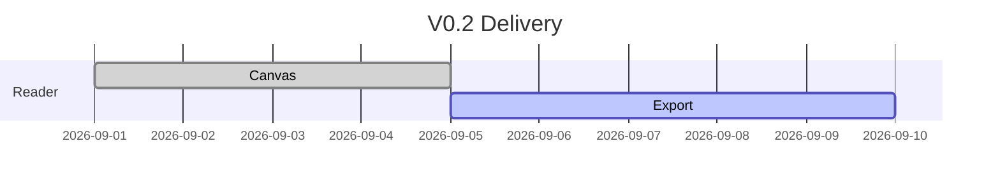
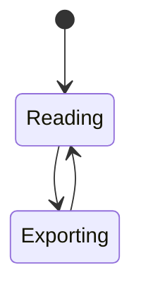
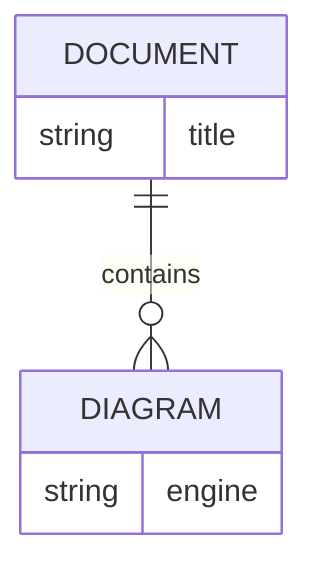
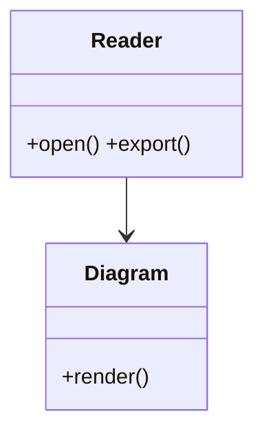
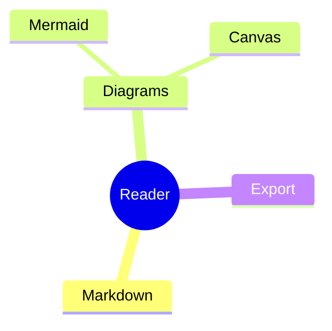

# 高级能力验收

## Mermaid Gantt


## Mermaid State


## Mermaid ER


## Mermaid Class


## Mermaid Mindmap


## JSON Canvas
```canvas
{
  "nodes": [
    {"id":"a","type":"text","x":0,"y":0,"width":220,"height":100,"text":"Markdown Reader"},
    {"id":"b","type":"text","x":360,"y":20,"width":220,"height":100,"text":"Offline Export"}
  ],
  "edges": [{"id":"e1","fromNode":"a","toNode":"b","label":"produces"}]
}
```

## Infographic
```infographic
infographic list-grid-badge-card
data
  title Reader Capabilities
  items
    - label Markdown
      desc Local-first reading
    - label Canvas
      desc JSON Canvas rendering
    - label DOCX
      desc Document export
```
