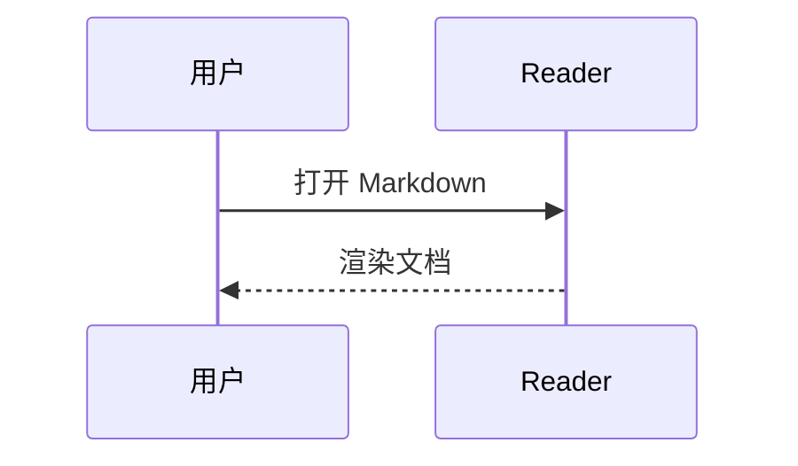
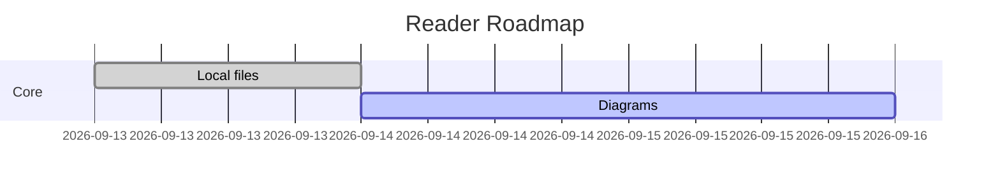
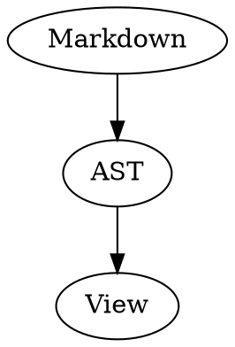
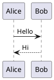

# Markdown Reader 验收样例

这是一个 **GFM** / 中文混排样例。

## 任务列表

- [x] 本地阅读
- [ ] 持续完善

## 表格

| 能力 | 状态 |
| --- | --- |
| Mermaid | 测试 |
| Graphviz | 测试 |

## 公式

$E = mc^2$

## Mermaid 时序图



## Mermaid 甘特图



## Graphviz



## Vega-Lite

```vega-lite
{"$schema":"https://vega.github.io/schema/vega-lite/v6.json","data":{"values":[{"a":"A","b":28},{"a":"B","b":55}]},"mark":"bar","encoding":{"x":{"field":"a","type":"nominal"},"y":{"field":"b","type":"quantitative"}}}
```

## ECharts

```echarts
{"xAxis":{"type":"category","data":["A","B","C"]},"yAxis":{"type":"value"},"series":[{"data":[120,200,150],"type":"bar"}]}
```

## PlantUML



