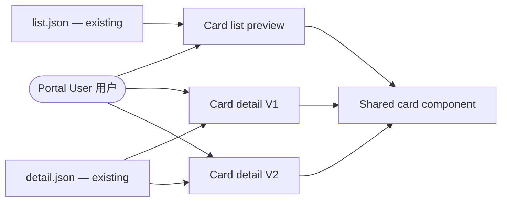
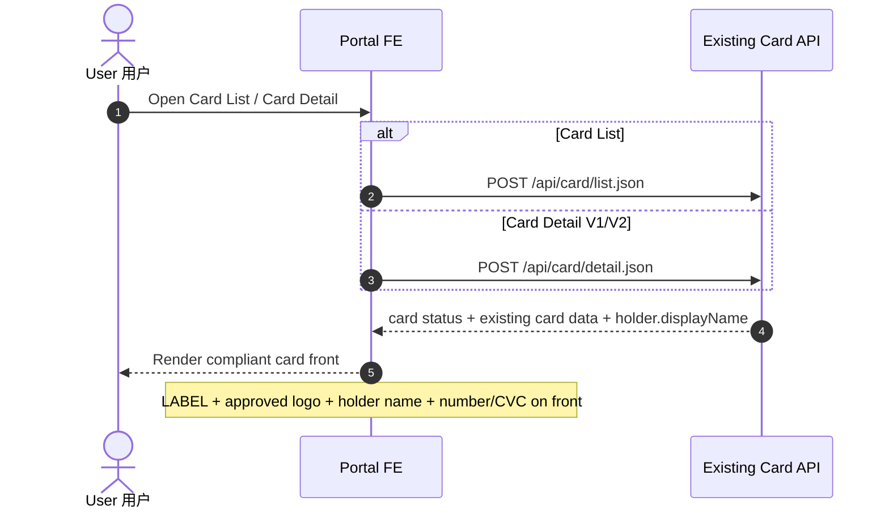
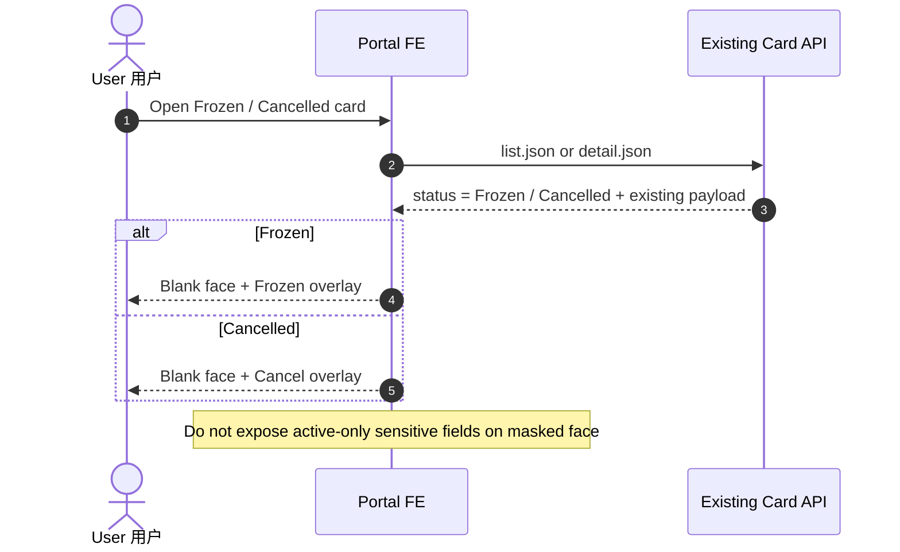
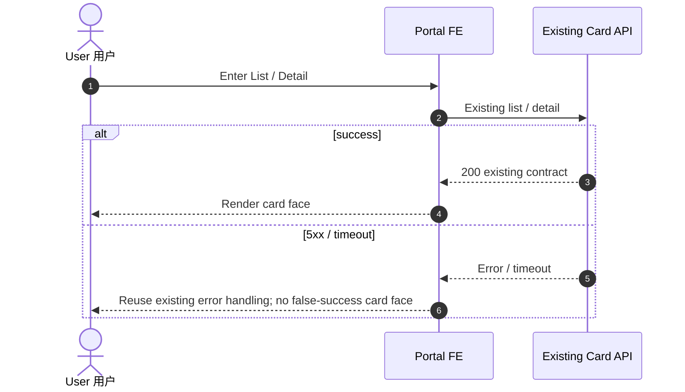
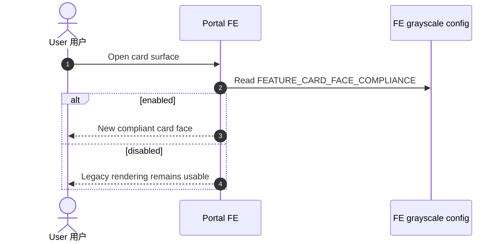

# Mermaid Runtime Regression

This fixture keeps the syntax shapes that matter for local technical-design documents while using only
synthetic product names and endpoints.

## Flowchart with quoted labels and Unicode

## Sequence with aliases, alternate branches and property paths

## Sequence with state values

## Sequence with 5xx and timeout text

## Sequence with long uppercase configuration key

