# SA Diagram Regression

This fixture mirrors diagram shapes found in real technical-design evaluation output while keeping all
business content synthetic and safe for the public repository.

## Mermaid module relationships

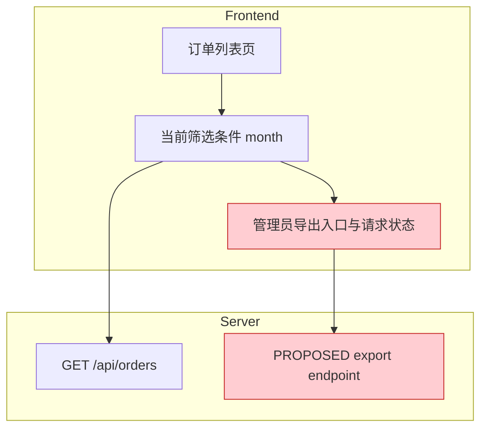

## Mermaid page flow

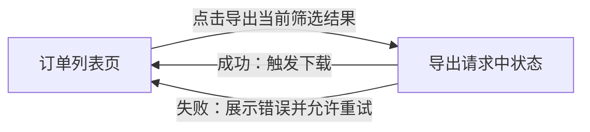

## Mermaid confirmed and uncertain navigation

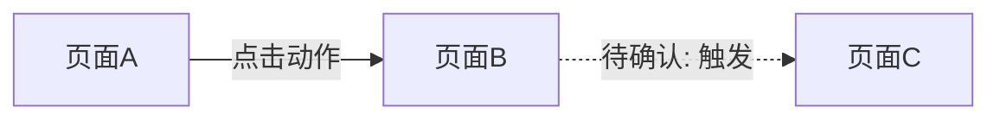

## Mermaid mixed navigation sources

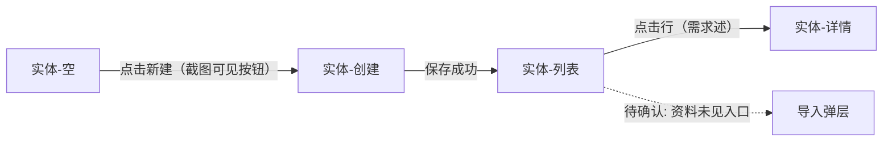

## Mermaid styled module chain

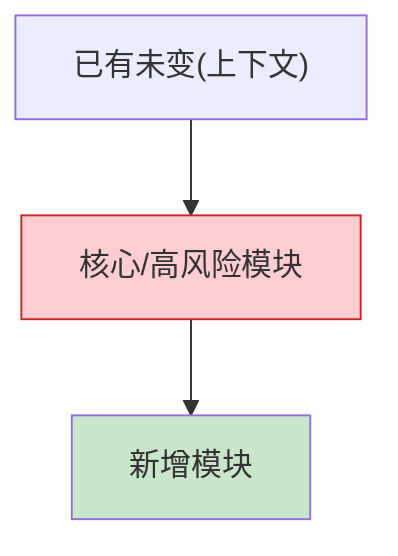

## Mermaid compact architecture

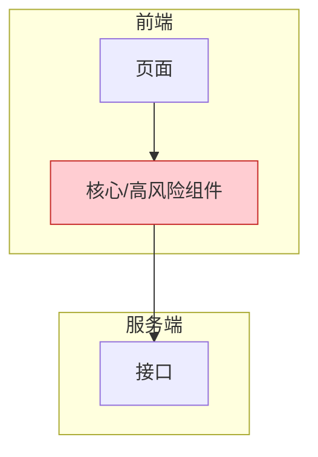

## PlantUML use case with colored notes

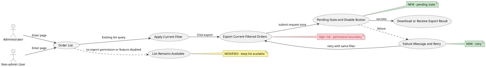

## PlantUML compact use case

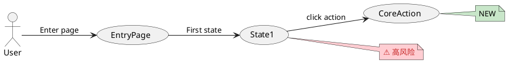

## PlantUML sequence with autonumber and branches

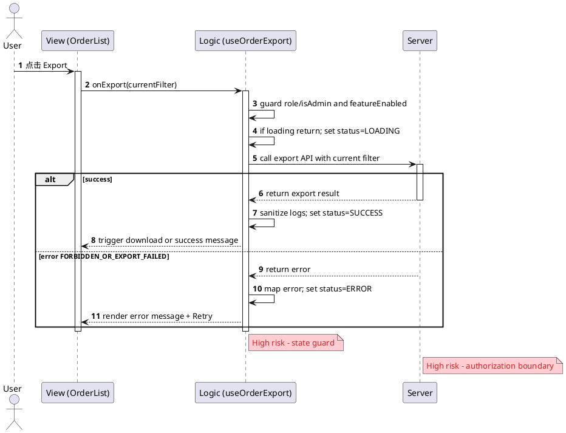

## PlantUML template placeholders and Unicode arrow

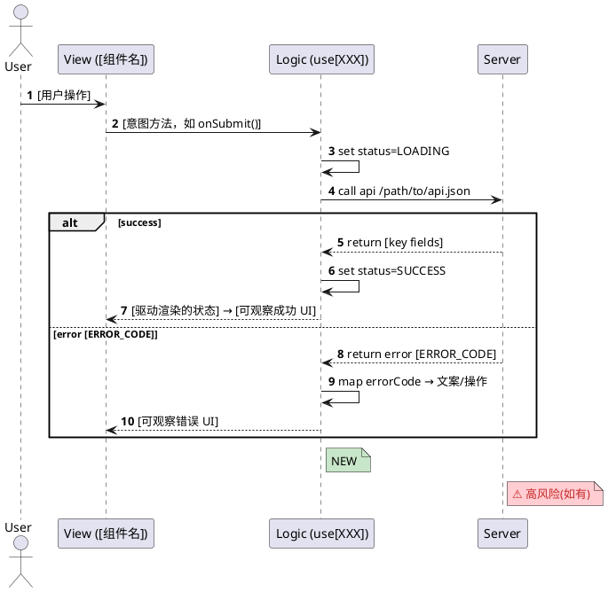

## PlantUML localized retry flow

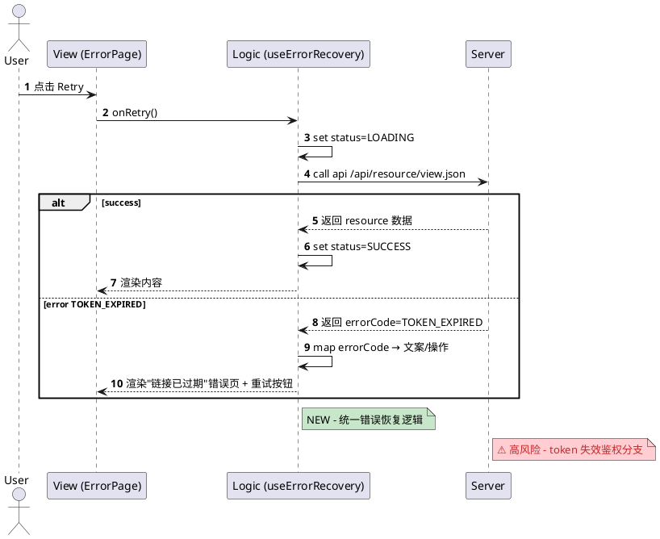
