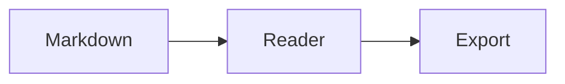

# Visual Contract

## Table

| Name | Value |
| --- | ---: |
| Reader | 3 |
| Diagrams | 9 |

> Stable visual fixture for layout regression.

```mermaid
flowchart LR
  A[Markdown] --> B[Reader]
  B --> C[Export]
```
